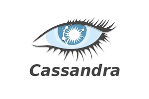

# CQL support for VS Code

## This is a language extension for the Cassandra CQL language.
Currently this addon only adds syntax highlighting for .cql files. This just makes it a bit easier to use the .cql extension without resorting to mapping .sql to .cql. It allows you to keep the two separate.

### For more information
* [github](https://github.com/lawrencekgrant/vscode-cql)

**Enjoy!**